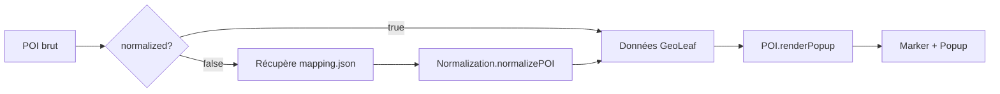

# GeoLeaf - Chemin critique d'initialisation (v3.2.0)

Product Version: GeoLeaf Platform V1  

## Vue d'ensemble

Ce document trace le **flux d'initialisation complet** de GeoLeaf, depuis le chargement des modules jusqu'à l'affichage final de la carte avec toutes ses couches.

---

## Diagramme de séquence - Initialisation complète

```mermaid
sequenceDiagram
    participant App as Application/CDN
    participant Main as bundle-entry.js
    participant API as GeoLeaf.API
    participant Config as Config Module
    participant Profile as Profile Module
    participant Core as Core Module
    participant BL as BaseLayers
    participant POI as POI Module
    participant GeoJSON as GeoJSON Module
    participant Route as Route Module
    participant UI as UI Module
    participant Legend as Legend Module
    participant Table as Table Module
    participant Map as Leaflet Map
    participant StoragePlugin as Storage Plugin
    participant SW as Service Worker

    %% Phase 1: Chargement du bundle core
    Note over App,Main: 🚀 PHASE 1: Chargement du bundle core
    App->>Main: Charge geoleaf.umd.js (bundle-entry.js)
    activate Main
    Main->>Main: imports séquentiels (Rollup)
    Note over Main: Ordre critique:<br/>1. Log, Security, Constants, Utils<br/>2. Core<br/>3. UI (theme, controls, panels)<br/>4. Config (loader, storage, profile)<br/>5. BaseLayers, Filters<br/>6. POI (normalizers, renderers)<br/>7. GeoJSON (layer-manager, loader)<br/>8. Route, Legend, Table<br/>9. API (en dernier)
    Main-->>App: ✓ Bundle core chargé
    deactivate Main

    %% Phase 1.5: Chargement des plugins + Boot
    Note over App,StoragePlugin: 🔌 PHASE 1.5: Plugins + Boot
    App->>StoragePlugin: Charge geoleaf-storage.plugin.js
    activate StoragePlugin
    StoragePlugin->>StoragePlugin: Object.assign(GeoLeaf, ~45 modules)
    StoragePlugin-->>App: ✓ Plugin Storage chargé
    deactivate StoragePlugin
    App->>Main: GeoLeaf.boot()
    activate Main
    Main->>Main: checkPlugins() — vérification cohérence
    Main-->>App: ✓ Événement: geoleaf:ready
    deactivate Main

    %% Phase 2: Chargement de la configuration
    Note over App,Config: 📋 PHASE 2: Chargement configuration
    App->>API: GeoLeaf.loadConfig(url, profileId)
    activate API
    API->>Config: Config.init({ url, profileId })
    activate Config
    Config->>Config: Loader.fetchJson(url)
    Note over Config: Fetch HTTP + validation<br/>Content-Type strict
    Config-->>API: Configuration de base chargée
    deactivate Config

    %% Phase 3: Activation du profil
    Note over App,Profile: 🎯 PHASE 3: Activation profil métier
    API->>Profile: loadActiveProfileResources()
    activate Profile
    Note over Profile: Détermine profil actif:<br/>config.data.activeProfile
    Profile->>Profile: Fetch profile.json
    Profile->>Profile: Fetch mapping.json (si normalized=false)
    Note over Profile: Mode layers-only:<br/>pas de poi.json/routes.json<br/>sauf si useLegacyProfileData=true
    Profile->>Profile: Normalisation taxonomie
    Profile-->>Profile: Événement: geoleaf:profile:loaded
    Profile-->>API: Configuration consolidée + profil
    deactivate Profile

    %% Phase 4: Initialisation de la carte
    Note over App,Map: 🗺️ PHASE 4: Création de la carte
    API-->>App: Événement: geoleaf:config:loaded
    App->>API: GeoLeaf.init({ map, ui })
    activate API
    API->>Core: Core.init({ mapId, center, zoom, theme })
    activate Core
    Core->>Core: Validation options (mapId requis)
    Core->>Map: L.map(element, options)
    activate Map
    Map-->>Core: Instance Leaflet
    Core->>UI: UI.applyTheme(theme)
    Core-->>API: Instance map
    deactivate Core
    API-->>App: Instance map
    deactivate API

    %% Phase 5: Initialisation UI
    Note over App,UI: 🎨 PHASE 5: Construction UI
    App->>UI: UI.init({ map, config })
    activate UI
    UI->>UI: buildFilterPanelFromActiveProfile()
    UI->>UI: initFilterToggle()
    UI->>UI: initProximityFilter(map)
    UI-->>App: UI initialisée
    deactivate UI

    App->>Table: Table.init({ map, config })
    activate Table
    Table->>Table: Création panneau table
    Table-->>App: ✓ Table prête
    deactivate Table

    %% Phase 5.5: Storage & Service Worker
    Note over App,SW: 💾 PHASE 5.5: Storage & Service Worker
    alt Si plugin Storage chargé
        App->>StoragePlugin: GeoLeaf.Storage.init(config.storage)
        activate StoragePlugin
        StoragePlugin->>StoragePlugin: IndexedDB.init() + CacheManager.init()
        StoragePlugin->>StoragePlugin: OfflineDetector.init()
        alt enableServiceWorker = true
            StoragePlugin->>SW: sw-register.register()
            activate SW
            SW-->>StoragePlugin: ✓ SW enregistré
            deactivate SW
        end
        StoragePlugin-->>App: ✓ Storage initialisé
        deactivate StoragePlugin
    end

    %% Phase 6: Basemaps
    Note over App,BL: 🗺️ PHASE 6: Fonds de carte
    App->>BL: BaseLayers.init({ map, baselayers, activeKey })
    activate BL
    BL->>BL: Enregistrement basemaps
    BL->>Map: Activation basemap par défaut
    BL->>BL: Création contrôles UI (selon showBaseLayerControls)
    BL-->>App: ✓ Basemaps prêtes
    deactivate BL

    %% Phase 7: Couches GeoJSON
    Note over App,GeoJSON: 📍 PHASE 7: Couches vectorielles
    App->>GeoJSON: GeoJSON.loadFromProfile()
    activate GeoJSON
    GeoJSON->>Profile: getActiveProfile()
    Profile-->>GeoJSON: profile.layers[]
    loop Pour chaque layer dans profile.layers
        GeoJSON->>GeoJSON: Fetch layer.url (GeoJSON/GPX)
        alt normalized = false
            GeoJSON->>Profile: getActiveProfileMapping()
            GeoJSON->>GeoJSON: Normalisation via mapping.json
        else normalized = true
            GeoJSON->>GeoJSON: Données déjà normalisées
        end
        GeoJSON->>GeoJSON: Application style (styleFn)
        alt clustering = true
            GeoJSON->>GeoJSON: Création MarkerClusterGroup
        end
        GeoJSON->>Map: Ajout L.geoJSON / cluster
    end
    GeoJSON-->>App: ✓ Couches chargées
    deactivate GeoJSON

    %% Phase 8: POI (mode legacy ou standalone)
    Note over App,POI: 📌 PHASE 8: Points d'intérêt
    alt Mode legacy (useLegacyProfileData=true)
        App->>POI: POI.init({ map, config })
        activate POI
        POI->>Profile: getActiveProfileData().poi
        POI->>POI: Normalisation POI
        loop Pour chaque POI
            POI->>POI: Rendu popup (renderers)
            POI->>POI: Création marker/icon
            alt clustering activé
                POI->>POI: Ajout au cluster
            else
                POI->>Map: Ajout marker
            end
        end
        POI-->>App: ✓ POI affichés
        deactivate POI
    else Mode layers-only
        Note over POI: POI gérés comme couches<br/>GeoJSON (étape précédente)
    end

    %% Phase 9: Routes
    Note over App,Route: 🛣️ PHASE 9: Itinéraires
    alt Si routes configurées
        App->>Route: Route.draw(data, options)
        activate Route
        alt Format GPX
            Route->>Route: Loaders.loadGPX(url)
            Route->>Route: Conversion GPX → GeoJSON
        else Format GeoJSON
            Route->>Route: Loaders.loadGeoJSON(url)
        end
        Route->>Route: Style resolver (couleur, épaisseur)
        Route->>Route: Popup builder (infos étape)
        Route->>Map: Ajout polyline/layer
        Route-->>App: ✓ Route affichée
        deactivate Route
    end

    %% Phase 10: Légende
    Note over App,Legend: 📖 PHASE 10: Légende & contrôles
    App->>Legend: Legend.init({ map, config })
    activate Legend
    Legend->>Legend: Collecte couches actives
    Legend->>Legend: Rendu légende (basemap, overlays)
    Legend->>Map: Ajout contrôle Leaflet
    Legend-->>App: ✓ Légende affichée
    deactivate Legend

    %% Phase 11: Finalisation
    Note over App,Map: ✅ PHASE 11: Finalisation
    alt Si POI/couches chargés
        App->>Map: map.fitBounds(bounds, padding)
    end
    App->>App: Événement: geoleaf:map:ready
    Note over App: Application prête<br/>Toutes couches visibles

```



---

## Tableau des étapes critiques

| # | Étape | Fichier source | Durée estimée | Point de synchronisation | Erreurs courantes |
|---|-------|----------------|---------------|--------------------------|-------------------|
| **1** | **Chargement bundle core** | `bundle-entry.js` | ~500-1000ms | Imports Rollup | Script 404, ordre incorrect |
| **1.5** | **Plugins + Boot** | `geoleaf-storage.plugin.js` | ~100-200ms | GeoLeaf.boot() | Plugin 404, namespace conflit |
| **2** | **Config globale** | `config/geoleaf-config/config-core.js` | ~50-200ms | Config.init() Promise | JSON invalide, CORS |
| **3** | **Profil actif** | `config/profile.js` | ~100-500ms | loadActiveProfileResources() Promise | profile.json 404, mapping manquant |
| **4** | **Carte Leaflet** | `geoleaf.core.js` | ~50-100ms | Core.init() synchrone | mapId invalide, Leaflet non chargé |
| **5** | **UI** | `geoleaf.ui.js` | ~100-200ms | UI.init() synchrone | Conteneurs DOM absents |
| **5.5** | **Storage + SW** | `geoleaf-storage.plugin.js` | ~100-300ms | Storage.init() Promise | IndexedDB indisponible, SW 404 |
| **6** | **BaseLayers** | `geoleaf.baselayers.js` | ~50ms | BaseLayers.init() synchrone | URL tuiles invalide |
| **7** | **GeoJSON** | `geoleaf.geojson.js` | ~200-2000ms | loadFromProfile() Promise | GeoJSON malformé, mapping incomplet |
| **8** | **POI** | `geoleaf.poi.js` | ~100-500ms | POI.init() + loadAndDisplay() | Normalisation échouée, coords invalides |
| **9** | **Routes** | `geoleaf.route.js` | ~100-500ms | Route.draw() Promise | GPX invalide, conversion échouée |
| **10** | **Légende** | `GeoLeaf.LayerManager.js` | ~50ms | Legend.init() synchrone | Template HTML absent |
| **11** | **FitBounds** | `demo.js` | ~50ms | setTimeout après POI | Bounds vides, zoom incorrect |

---

## Points de synchronisation (Promises & Events)

### Promises critiques

```javascript
// 1. Chargement modules (imports Rollup)
// bundle-entry.js gère l'ordre des imports

// 2. Configuration + profil (chaîné)
GeoLeaf.loadConfig({ url, profileId })
  .then(cfg => Config.loadActiveProfileResources())
  .then(consolidatedConfig => { /* init app */ })

// 3. Couches GeoJSON (parallèle)
Promise.all(layers.map(layer => GeoJSON.load(layer.url)))
  .then(loadedLayers => { /* fitBounds */ })
```

### Événements DOM

| Événement | Émetteur | Quand | Utilisation |
|-----------|----------|-------|-------------|
| `geoleaf:ready` | boot.js | Tous modules + plugins chargés | Démarrage app |
| `geoleaf:config:loaded` | Config | Config + profil chargés | Init carte |
| `geoleaf:profile:loaded` | Profile | Profil actif chargé | Init couches |
| `geoleaf:map:ready` | App | Carte + couches prêtes | Analytics, hooks |
| `geoleaf:poi:click` | POI | Clic sur marqueur | Panneau latéral |
| `geoleaf:basemap:change` | BaseLayers | Changement fond | Analytics |
| `geoleaf:storage:initialized` | Storage | Storage initialisé | Cache ready |
| `geoleaf:offline` | OfflineDetector | Connexion perdue | Mode offline |
| `geoleaf:online` | OfflineDetector | Connexion rétablie | Sync |
| `geoleaf:sw:updated` | sw-register | Nouvelle version SW | Prompt reload |

---

## Modes d'initialisation

### Mode 1: Layers-only (v2.0, recommandé)

```javascript
// config.data.useLegacyProfileData = false (défaut)
// profile.json contient layers[] avec GeoJSON
{
  "layers": [
    {
      "id": "poi-restaurants",
      "type": "geojson",
      "url": "data/restaurants.geojson",
      "normalized": true,  // Données déjà au format GeoLeaf
      "clustering": true
    }
  ]
}
```

**Flux** : Config → Profile → GeoJSON.loadFromProfile() → Map

### Mode 2: Legacy (v1.x, backward compat)

```javascript
// config.data.useLegacyProfileData = true
// poi.json + routes.json chargés séparément
```

**Flux** : Config → Profile → POI.init() → Route.draw() → Map

---

## Normalisation des données

### Pipeline de normalisation POI



### Champs critiques

| Champ source | Champ GeoLeaf | Transformation |
|--------------|---------------|----------------|
| `lat`/`lng` | `location.lat`/`lng` | Direct |
| `name` | `label` | Direct |
| `category` | `attributes.categoryId` | Via mapping |
| `subcategory` | `attributes.subcategoryId` | Via mapping |
| Custom fields | `properties.*` | Préservés |

---

## Gestion d'erreurs par module

### Config

```javascript
try {
  await Config.loadUrl(url, { strictContentType: true })
} catch (err) {
  if (err.message.includes('Content-Type')) {
    // Serveur non configuré pour JSON
  }
  // Fallback: config inline
}
```

### Profile

```javascript
try {
  await Profile.loadActiveProfileResources()
} catch (err) {
  // profile.json absent → profil ignoré
  // mapping.json absent + normalized=false → erreur bloquante
}
```

### GeoJSON

```javascript
try {
  const layer = await GeoJSON.load(url)
} catch (err) {
  // GeoJSON malformé → couche ignorée
  // URL 404 → log warning
}
```

---

## Optimisations de performance

### Chargement parallèle

```javascript
// ✅ BON: Chargement parallèle des couches
const layers = await Promise.all(
  profile.layers.map(l => GeoJSON.load(l.url))
)

// ❌ MAUVAIS: Chargement séquentiel
for (const layer of profile.layers) {
  await GeoJSON.load(layer.url) // Bloque sur chaque couche
}
```

### Cache & timestamps

```javascript
// Éviter cache navigateur pour config
const url = `data/config.json?t=${Date.now()}`

// Cache OK pour tuiles statiques
{ url: "https://tiles.example.com/{z}/{x}/{y}.png" }
```

### Clustering intelligent

```javascript
// POI nombreux (>100) → activer clustering
if (poi.length > 100) {
  POI.init({ map, clustering: true })
}
```

---

## Debugging du flow

### Console logs critiques

```javascript
// bundle-entry.js (Rollup imports)
// Les modules sont chargés dans l'ordre défini dans bundle-entry.js

// Config
console.log('[Config] Configuration chargée:', cfg)
console.log('[Profile] Profil actif:', profileId)

// GeoJSON
console.log('[GeoJSON] Couche chargée:', layerId, featureCount)

// Map
console.log('[Demo] Carte ajustée sur emprise')
```

### Breakpoints recommandés

1. `app/boot.js:50` → Après chargement modules
2. `config/geoleaf-config/config-core.js:90` → Config chargée
3. `config/profile.js:120` → Profil chargé
4. `geoleaf.core.js:85` → Carte créée
5. `geoleaf.geojson.js:200` → Couches ajoutées

### DevTools Network

**Ordre attendu des requêtes** :

1. `geoleaf.config.json`
2. `profiles/{profileId}/profile.json`
3. `profiles/{profileId}/mapping.json` (si nécessaire)
4. `data/layers/*.geojson` (parallèle)
5. Tuiles de basemap

---

## Migration v1 → v2

### Changements majeurs

| v1.x | v2.0 | Migration |
|------|------|-----------|
| `poi.json` chargé automatiquement | Couches GeoJSON dans `profile.json` | Convertir POI → GeoJSON |
| Mapping toujours utilisé | `normalized: true` skip mapping | Pré-normaliser données |
| Routes séparées | Routes = couches GeoJSON | Inclure dans layers[] |

### Checklist migration

- [ ] Convertir `poi.json` → `layer.geojson` avec `normalized: true`
- [ ] Ajouter `layers[]` dans `profile.json`
- [ ] Mettre `config.data.useLegacyProfileData = false`
- [ ] Tester chargement sans `poi.json`/`routes.json`
- [ ] Vérifier clustering sur couches GeoJSON
- [ ] Adapter filtres UI pour couches vs POI

---

## Références

- **Code source** : `src/bundle-entry.js`, `src/app/boot.js`, `src/app/init.js`, `src/app/helpers.js`
- **Plugins** : `src/plugins/geoleaf-storage.plugin.js`, `src/plugins/geoleaf-addpoi.plugin.js`
- **Modules** : `config/geoleaf-config/config-core.js`, `config/profile.js`, `geoleaf.core.js`
- **Storage** : `src/static/js/storage/` (32 fichiers)
- **Documentation** : [Architecture Plugin](../plugins/GeoLeaf_Plugins_README.md), [Storage](../storage/GeoLeaf_Storage_README.md)
- **Tests** : `__tests__/config/profile.test.js`, `__tests__/core/core-init.test.js`

---

**Dernière mise à jour** : 15 février 2026  
**Version GeoLeaf** : 3.2.0
