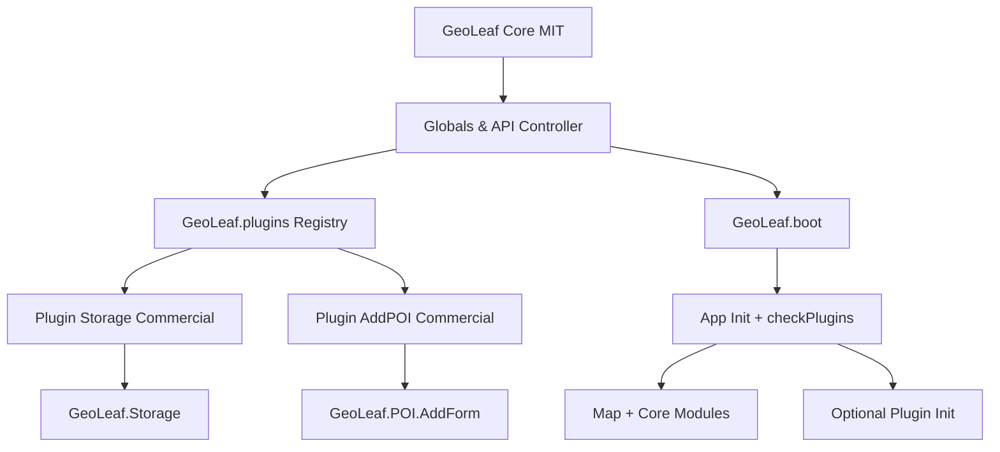
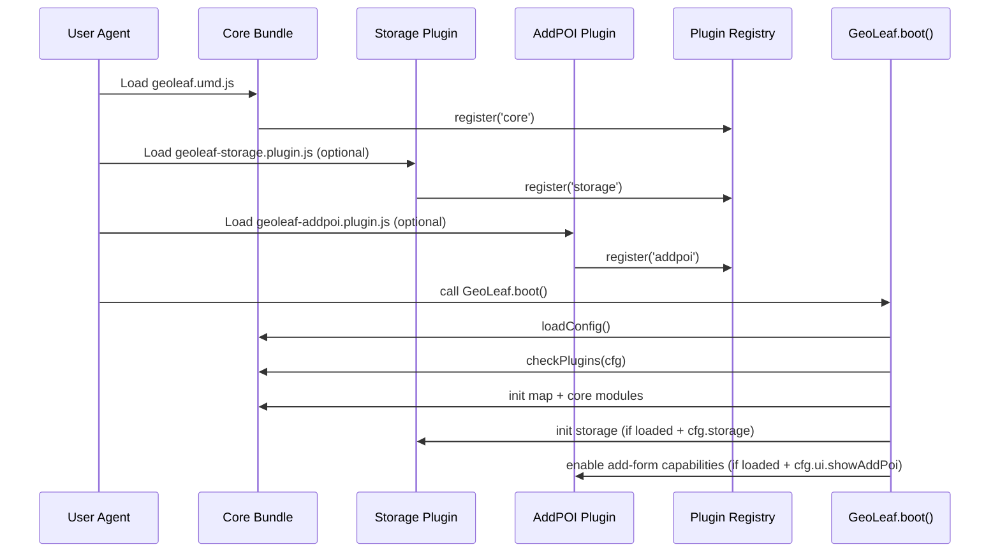

# Schéma d’architecture — Core, Plugins, Registry, Boot Sequence

**Version produit :** GeoLeaf Platform V1  
**Version :** 1.1.1  
**Date :** 2026-03-15

> Convention de versioning : **Platform V1** est le label produit ; le SemVer technique des packages/releases reste en **1.1.x**. Voir [../VERSIONING_POLICY.md](../VERSIONING_POLICY.md).

---

## 1. Vue d’ensemble

GeoLeaf est structuré autour d’un **core MIT** et de **plugins premium optionnels**.
Le core initialise l’application et les plugins enrichissent des namespaces existants (`GeoLeaf.Storage`, `GeoLeaf.POI.AddForm`, etc.) via un registre.

---

## 2. Schéma logique

---

## 3. Boot sequence (runtime)

---

## 4. Contrats de responsabilité

- **Core (MIT)**
    - Cycle de vie global (`boot`, `loadConfig`, `init`, `setTheme`)
    - API publique et registre plugins
    - Guards de compatibilité (`checkPlugins`)

- **Storage (Commercial)**
    - IndexedDB, cache offline, sync, SW premium
    - Namespace principal : `GeoLeaf.Storage`

- **AddPOI (Commercial)**
    - Formulaire POI, placement, upload image, validation
    - Namespace principal : `GeoLeaf.POI.AddForm`

---

## 5. Règles d’intégration

1. Toujours charger le core en premier.
2. Charger les plugins avant `GeoLeaf.boot()`.
3. Activer les options plugin côté profil (`storage`, `showAddPoi`).
4. Ne pas supposer la présence d’un plugin sans vérification runtime.

---

## 6. Références

- `docs/architecture/BOOT_SEQUENCE.md`
- `docs/plugins/GeoLeaf_Plugins_README.md`
- `docs/guides/INTEGRATION_PLUGIN_STORAGE.md`
- `docs/guides/INTEGRATION_PLUGIN_ADDPOI.md`
