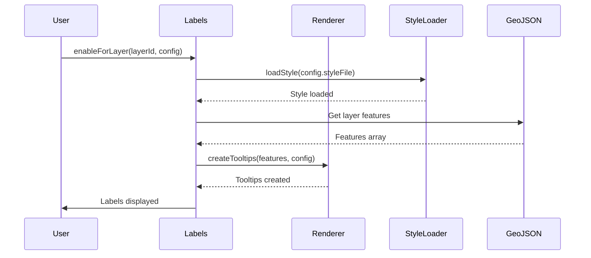

# GeoLeaf.Labels – Documentation du module Labels

**Product Version:** GeoLeaf Platform V1  

**Version**: 3.2.0  
**Fichiers**: 
- `src/static/js/labels/labels.js` (365 lignes)
- `src/static/js/labels/label-renderer.js`
- `src/static/js/labels/label-style-loader.js`  
**Dernière mise à jour**: 19 janvier 2026

---

## 📌 Vue d'ensemble

Le module **GeoLeaf.Labels** fournit un système de gestion des **étiquettes flottantes** (tooltips permanents) sur les entités cartographiques. Il permet d'afficher du texte ou des icônes au-dessus des features GeoJSON de manière permanente, avec contrôle du zoom et des styles personnalisables.

### Responsabilités principales

- ✅ **Affichage d'étiquettes** - Tooltips permanents sur les features
- ✅ **Gestion par couche** - Activation/désactivation par layer
- ✅ **Styles personnalisés** - Chargement de fichiers de style CSS
- ✅ **Contrôle du zoom** - Affichage conditionnel selon le niveau de zoom
- ✅ **Rendu dynamique** - Templates pour le contenu des labels

---

## 🏗️ Architecture

Le module Labels est composé de 3 sous-modules :

### 1. **labels.js** (365 lignes)
Module principal orchestrateur :
- Initialisation du système
- Gestion de l'état des layers
- Attachement des événements de couches
- API publique

### 2. **label-renderer.js**
Responsable du rendu des tooltips :
- Création des tooltips Leaflet
- Application des templates
- Mise à jour dynamique
- Gestion du cycle de vie

### 3. **label-style-loader.js**
Chargement des styles CSS :
- Cache des styles
- Injection dynamique dans le DOM
- Gestion des erreurs de chargement

---

## 📚 API Publique

### `Labels.init(options)`

Initialise le système de labels.

**Signature** :
```js
GeoLeaf.Labels.init(options)
```

**Paramètres** :
- `options` (Object) - Options d'initialisation (optionnel)
  - `defaultEnabled` (Boolean) - Activer par défaut sur toutes les couches (défaut: `false`)

**Exemple** :
```js
// Initialisation simple
GeoLeaf.Labels.init();

// Avec options
GeoLeaf.Labels.init({
    defaultEnabled: false
});
```

---

### `Labels.enableForLayer(layerId, config)`

Active les labels pour une couche spécifique.

**Signature** :
```js
GeoLeaf.Labels.enableForLayer(layerId, config)
```

**Paramètres** :
- `layerId` (String) - ID de la couche GeoJSON
- `config` (Object) - Configuration des labels
  - `property` (String) - Propriété à afficher (ex: `"name"`, `"label"`)
  - `template` (String|Function) - Template du label (optionnel)
  - `minZoom` (Number) - Zoom minimum d'affichage (optionnel)
  - `maxZoom` (Number) - Zoom maximum d'affichage (optionnel)
  - `styleFile` (String) - URL du fichier CSS de style (optionnel)
  - `permanent` (Boolean) - Tooltip permanent (défaut: `true`)
  - `direction` (String) - Direction du tooltip: `"auto"`, `"top"`, `"bottom"`, `"left"`, `"right"` (défaut: `"auto"`)
  - `className` (String) - Classes CSS additionnelles (optionnel)

**Exemple** :
```js
// Label simple avec propriété
GeoLeaf.Labels.enableForLayer('poi_restaurants', {
    property: 'name',
    minZoom: 14
});

// Label avec template
GeoLeaf.Labels.enableForLayer('poi_hotels', {
    template: (properties) => `${properties.name} (${properties.stars}⭐)`,
    minZoom: 13,
    styleFile: 'styles/labels/hotels.css'
});

// Label avec string template
GeoLeaf.Labels.enableForLayer('poi_monuments', {
    template: '{name} - {year}',
    direction: 'top',
    className: 'monument-label'
});
```

---

### `Labels.disableForLayer(layerId)`

Désactive les labels pour une couche.

**Signature** :
```js
GeoLeaf.Labels.disableForLayer(layerId)
```

**Paramètres** :
- `layerId` (String) - ID de la couche

**Exemple** :
```js
GeoLeaf.Labels.disableForLayer('poi_restaurants');
```

---

### `Labels.updateStyle(layerId, styleConfig)`

Met à jour le style des labels d'une couche.

**Signature** :
```js
GeoLeaf.Labels.updateStyle(layerId, styleConfig)
```

**Paramètres** :
- `layerId` (String) - ID de la couche
- `styleConfig` (Object) - Nouvelle configuration de style
  - `styleFile` (String) - URL du nouveau fichier CSS
  - `className` (String) - Nouvelles classes CSS

**Exemple** :
```js
GeoLeaf.Labels.updateStyle('poi_restaurants', {
    styleFile: 'styles/labels/restaurants-night.css'
});
```

---

### `Labels.isEnabled(layerId)`

Vérifie si les labels sont actifs pour une couche.

**Signature** :
```js
GeoLeaf.Labels.isEnabled(layerId) : Boolean
```

**Exemple** :
```js
if (GeoLeaf.Labels.isEnabled('poi_restaurants')) {
    console.log('Labels actifs');
}
```

---

## 🎨 Configuration dans profile.json

Les labels peuvent être configurés directement dans le fichier de profil :

```json
{
    "geojsonLayers": [
        {
            "id": "poi_restaurants",
            "name": "Restaurants",
            "source": "data/restaurants.geojson",
            "labels": {
                "enabled": true,
                "property": "name",
                "minZoom": 14,
                "direction": "top",
                "styleFile": "styles/labels/restaurants.css"
            }
        },
        {
            "id": "tourism_routes",
            "name": "Itinéraires touristiques",
            "source": "data/routes.geojson",
            "labels": {
                "enabled": true,
                "template": "{name} - {distance}km",
                "minZoom": 12,
                "className": "route-label"
            }
        }
    ]
}
```

---

## 💡 Exemples d'utilisation

### Exemple 1 : Labels simples

```js
// Initialiser le module
GeoLeaf.Labels.init();

// Charger une couche GeoJSON
GeoLeaf.GeoJSON.load({
    id: 'cities',
    url: 'data/cities.geojson'
});

// Activer les labels sur les villes
GeoLeaf.Labels.enableForLayer('cities', {
    property: 'name',
    minZoom: 10,
    direction: 'center'
});
```

### Exemple 2 : Labels avec template fonction

```js
GeoLeaf.Labels.enableForLayer('poi_shops', {
    template: (props) => {
        const icon = props.type === 'grocery' ? '🛒' : '🏪';
        return `${icon} ${props.name}`;
    },
    minZoom: 15,
    className: 'shop-label'
});
```

### Exemple 3 : Labels avec gestion du zoom

```js
const map = GeoLeaf.Core.getMap();

// Activer/désactiver selon le zoom
map.on('zoomend', () => {
    const zoom = map.getZoom();
    
    if (zoom >= 14) {
        GeoLeaf.Labels.enableForLayer('poi_restaurants', {
            property: 'name',
            styleFile: 'styles/labels/detailed.css'
        });
    } else {
        GeoLeaf.Labels.disableForLayer('poi_restaurants');
    }
});
```

### Exemple 4 : Labels multilingues

```js
const currentLang = localStorage.getItem('language') || 'fr';

GeoLeaf.Labels.enableForLayer('poi_museums', {
    template: (props) => props[`name_${currentLang}`] || props.name,
    minZoom: 13
});
```

---

## 🎨 Styles CSS personnalisés

### Structure d'un fichier de style

```css
/* styles/labels/custom.css */

/* Style de base du label */
.leaflet-tooltip.custom-label {
    background: rgba(0, 0, 0, 0.8);
    border: 2px solid #fff;
    border-radius: 4px;
    color: white;
    font-weight: bold;
    font-size: 12px;
    padding: 4px 8px;
    box-shadow: 0 2px 4px rgba(0,0,0,0.3);
}

/* Pointer (flèche) du tooltip */
.leaflet-tooltip.custom-label:before {
    border-top-color: #fff;
}

/* Style pour différents états */
.leaflet-tooltip.custom-label.highlighted {
    background: rgba(255, 140, 0, 0.9);
    border-color: #ff8c00;
}
```

### Application du style

```js
GeoLeaf.Labels.enableForLayer('my_layer', {
    property: 'name',
    styleFile: 'styles/labels/custom.css',
    className: 'custom-label'
});
```

---

## 🔧 Fonctionnement interne

### 1. État du module

```js
const _state = {
    // Map: layerId -> { enabled, config, tooltips }
    layers: new Map(),
    // Cache: styleFile -> styleObject
    styleCache: new Map(),
    // Flag écouteur de zoom
    zoomListenerAttached: false
};
```

### 2. Séquence d'activation



### 3. Gestion du zoom

Le module attache un écouteur sur l'événement `zoomend` de la carte pour mettre à jour l'affichage des labels selon les contraintes `minZoom` et `maxZoom` :

```js
map.on('zoomend', () => {
    const zoom = map.getZoom();
    _state.layers.forEach((layerState, layerId) => {
        const { config, tooltips } = layerState;
        if (config.minZoom && zoom < config.minZoom) {
            // Cacher les tooltips
            tooltips.forEach(t => t.remove());
        } else if (config.maxZoom && zoom > config.maxZoom) {
            // Cacher les tooltips
            tooltips.forEach(t => t.remove());
        } else {
            // Afficher les tooltips
            tooltips.forEach(t => t.addTo(map));
        }
    });
});
```

---

## ⚠️ Limitations et notes

### 1. Performance
- ⚠️ **Grand nombre de features** : Au-delà de 500-1000 labels visibles simultanément, les performances peuvent se dégrader
- ✅ **Solution** : Utiliser `minZoom` pour limiter l'affichage ou activer le clustering

### 2. Compatibilité
- ✅ Compatible avec les couches GeoJSON
- ⚠️ Non compatible avec les marqueurs POI directs (utiliser le système de popup POI à la place)
- ✅ Fonctionne avec tous les types de géométries (Point, LineString, Polygon)

### 3. Styles
- Les styles CSS doivent être chargés avant l'affichage
- Le cache des styles est conservé pendant toute la session
- Les fichiers CSS doivent être accessibles (CORS)

---

## 🔗 Modules liés

- **GeoLeaf.GeoJSON** - Fournit les couches et features pour les labels
- **GeoLeaf.Log** - Journalisation des opérations
- **Leaflet.Tooltip** - API native Leaflet pour les tooltips

---

## 📈 Améliorations futures

### Prévues
- [ ] Support des icônes dans les labels
- [ ] Animation d'entrée/sortie des labels
- [ ] Collision detection (éviter la superposition)
- [ ] Clustering intelligent des labels
- [ ] Templates HTML enrichis (pas seulement texte)

### En discussion
- [ ] Édition inline des labels
- [ ] Export des labels en PDF/Image
- [ ] Synchronisation avec le système de filtres

---

## 📝 Exemple complet

```js
// 1. Initialiser GeoLeaf
GeoLeaf.init({
    map: {
        target: 'map',
        center: [48.8566, 2.3522],
        zoom: 12
    }
});

// 2. Initialiser le module Labels
GeoLeaf.Labels.init();

// 3. Charger des données GeoJSON
GeoLeaf.GeoJSON.load({
    id: 'restaurants',
    url: 'data/restaurants.geojson'
});

// 4. Activer les labels avec style personnalisé
GeoLeaf.Labels.enableForLayer('restaurants', {
    template: (props) => `${props.name} ⭐${props.rating}`,
    minZoom: 14,
    maxZoom: 18,
    direction: 'top',
    styleFile: 'styles/labels/restaurants.css',
    className: 'restaurant-label'
});

// 5. Gérer les interactions
document.getElementById('toggle-labels').addEventListener('click', () => {
    if (GeoLeaf.Labels.isEnabled('restaurants')) {
        GeoLeaf.Labels.disableForLayer('restaurants');
    } else {
        GeoLeaf.Labels.enableForLayer('restaurants', { property: 'name' });
    }
});
```

---

**Dernière mise à jour** : 19 janvier 2026  
**Version GeoLeaf** : 3.2.0
