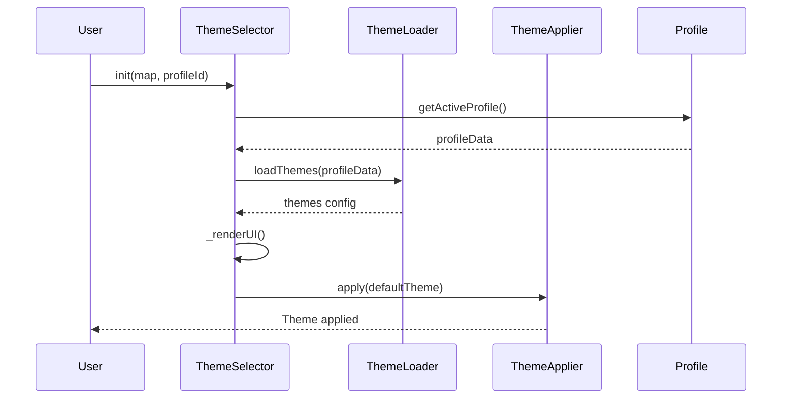

# GeoLeaf.Themes – Documentation du module Themes

Product Version: GeoLeaf Platform V1  
**Version**: 4.0.0  
**Fichiers**:

- `src/modules/themes/theme-selector.js` (561 lignes)
- `src/modules/themes/theme-loader.js`
- `src/modules/themes/theme-applier/` ⭐ (4 sous-modules : core.js, visibility.js, deferred.js, ui-sync.js)  
  **Dernière mise à jour**: 14 février 2026

---

## 📌 Vue d'ensemble

Le module **GeoLeaf.Themes** fournit un système avancé de gestion des thèmes visuels avec support des **thèmes principaux** (primaires) et **thèmes secondaires**. Il permet aux utilisateurs de personnaliser l'apparence de la carte via une interface intuitive (dropdown ou boutons).

### Responsabilités principales

- ✅ **Gestion multi-thèmes** - Thèmes primaires + secondaires
- ✅ **Chargement dynamique** - Depuis la configuration de profil
- ✅ **Application de styles** - Modification des classes CSS de la carte
- ✅ **UI intégrée** - Sélecteurs de thèmes automatiques
- ✅ **Persistance** - Sauvegarde du thème choisi (localStorage)
- ✅ **Événements** - Notifications des changements de thème

---

## 🏗️ Architecture

Le module Themes est composé de 3 sous-modules complémentaires :

### 1. **theme-selector.js** (561 lignes)

Contrôleur principal :

- Orchestration du système
- Gestion de l'état
- Rendu de l'interface utilisateur
- Gestion des événements UI

### 2. **theme-loader.js**

Chargement de la configuration :

- Lecture des thèmes depuis `profile.json`
- Validation de la structure
- Classification (primaire/secondaire)
- Cache des thèmes

### 3. **theme-applier/** (4 sous-modules v4.0.0)

Application des thèmes, éclaté en :

- **core.js** : État, init/cleanup, applyTheme orchestrator
- **visibility.js** : Visibilité couches, styles, labels
- **deferred.js** : Chargement différé, résolution URLs
- **ui-sync.js** : Synchronisation UI (sélecteur style, légende, fitBounds)

---

## 📚 API Publique

### `ThemeSelector.init(map, profileId)`

Initialise le système de thèmes pour une carte.

**Signature** :

```js
GeoLeaf.ThemeSelector.init(map, profileId);
```

**Paramètres** :

- `map` (L.Map) - Instance de la carte Leaflet
- `profileId` (String) - ID du profil actif (optionnel)

**Retour** :

- (Boolean) - `true` si initialisation réussie

**Exemple** :

```js
const map = GeoLeaf.Core.getMap();
GeoLeaf.ThemeSelector.init(map, "tourism");
```

---

### `ThemeSelector.setTheme(themeId)`

Change le thème actif.

**Signature** :

```js
GeoLeaf.ThemeSelector.setTheme(themeId);
```

**Paramètres** :

- `themeId` (String) - ID du thème à activer

**Retour** :

- (Boolean) - `true` si changement réussi

**Événements** :

- `theme:changed` - Émis après changement de thème

**Exemple** :

```js
// Changer vers un thème spécifique
GeoLeaf.ThemeSelector.setTheme("dark");

// Écouter les changements
document.addEventListener("theme:changed", (e) => {
    console.log("Nouveau thème:", e.detail.themeId);
});
```

---

### `ThemeSelector.getCurrentTheme()`

Récupère le thème actuellement actif.

**Signature** :

```js
GeoLeaf.ThemeSelector.getCurrentTheme() : String|null
```

**Retour** :

- (String|null) - ID du thème actif, ou `null` si aucun

**Exemple** :

```js
const currentTheme = GeoLeaf.ThemeSelector.getCurrentTheme();
console.log("Thème actif:", currentTheme);
```

---

### `ThemeSelector.getAvailableThemes()`

Liste tous les thèmes disponibles.

**Signature** :

```js
GeoLeaf.ThemeSelector.getAvailableThemes() : Object
```

**Retour** :

- (Object) - Objet avec `primary` et `secondary` arrays

**Exemple** :

```js
const themes = GeoLeaf.ThemeSelector.getAvailableThemes();
console.log("Thèmes primaires:", themes.primary);
console.log("Thèmes secondaires:", themes.secondary);
```

---

### `ThemeSelector.destroy()`

Nettoie le module et supprime les écouteurs.

**Signature** :

```js
GeoLeaf.ThemeSelector.destroy();
```

**Exemple** :

```js
GeoLeaf.ThemeSelector.destroy();
```

---

## 🎨 Configuration dans profile.json

Les thèmes sont définis dans la section `themes` du fichier de profil :

```json
{
    "themes": {
        "default": "light",
        "primary": [
            {
                "id": "light",
                "label": "Clair",
                "icon": "☀️",
                "cssClass": "theme-light"
            },
            {
                "id": "dark",
                "label": "Sombre",
                "icon": "🌙",
                "cssClass": "theme-dark"
            }
        ],
        "secondary": [
            {
                "id": "high-contrast",
                "label": "Contraste élevé",
                "icon": "👁️",
                "cssClass": "theme-high-contrast",
                "basedOn": "light"
            },
            {
                "id": "colorblind",
                "label": "Daltonien",
                "icon": "🎨",
                "cssClass": "theme-colorblind",
                "basedOn": "light"
            }
        ],
        "ui": {
            "position": "topright",
            "style": "dropdown",
            "showLabels": true,
            "groupSecondary": true
        }
    }
}
```

### Structure d'un thème

| Propriété  | Type   | Obligatoire | Description                       |
| ---------- | ------ | ----------- | --------------------------------- |
| `id`       | String | ✅          | Identifiant unique du thème       |
| `label`    | String | ✅          | Nom affiché à l'utilisateur       |
| `icon`     | String | ❌          | Emoji ou icône Unicode            |
| `cssClass` | String | ✅          | Classe CSS appliquée au conteneur |
| `basedOn`  | String | ❌          | Thème parent (pour secondaires)   |

### Options UI

| Propriété        | Type    | Défaut       | Description                                                           |
| ---------------- | ------- | ------------ | --------------------------------------------------------------------- |
| `position`       | String  | `"topright"` | Position Leaflet : `topleft`, `topright`, `bottomleft`, `bottomright` |
| `style`          | String  | `"dropdown"` | Style d'UI : `"dropdown"` (menu déroulant) ou `"buttons"` (boutons)   |
| `showLabels`     | Boolean | `true`       | Afficher les labels texte                                             |
| `groupSecondary` | Boolean | `true`       | Grouper les thèmes secondaires séparément                             |

---

## 💡 Exemples d'utilisation

### Exemple 1 : Configuration simple (2 thèmes)

```json
{
    "themes": {
        "default": "light",
        "primary": [
            {
                "id": "light",
                "label": "Jour",
                "icon": "☀️",
                "cssClass": "theme-light"
            },
            {
                "id": "dark",
                "label": "Nuit",
                "icon": "🌙",
                "cssClass": "theme-dark"
            }
        ],
        "ui": {
            "position": "topright",
            "style": "buttons"
        }
    }
}
```

### Exemple 2 : Thèmes avec hiérarchie

```json
{
    "themes": {
        "default": "standard",
        "primary": [
            {
                "id": "standard",
                "label": "Standard",
                "cssClass": "theme-standard"
            }
        ],
        "secondary": [
            {
                "id": "large-text",
                "label": "Gros texte",
                "cssClass": "theme-large-text",
                "basedOn": "standard"
            },
            {
                "id": "high-contrast",
                "label": "Fort contraste",
                "cssClass": "theme-high-contrast",
                "basedOn": "standard"
            }
        ]
    }
}
```

### Exemple 3 : Changement programmatique

```js
// Initialiser avec détection automatique
GeoLeaf.ThemeSelector.init(map, "tourism");

// Changer de thème selon l'heure
const hour = new Date().getHours();
const theme = hour >= 6 && hour < 18 ? "light" : "dark";
GeoLeaf.ThemeSelector.setTheme(theme);

// Changer selon préférence système
if (window.matchMedia("(prefers-color-scheme: dark)").matches) {
    GeoLeaf.ThemeSelector.setTheme("dark");
}
```

### Exemple 4 : Thème avec options utilisateur

```js
// Panneau de préférences personnalisé
const userPrefs = {
    theme: "light",
    largeText: false,
    highContrast: false,
};

// Appliquer les préférences
let themeId = userPrefs.theme;

if (userPrefs.highContrast) {
    themeId = "high-contrast";
} else if (userPrefs.largeText) {
    themeId = "large-text";
}

GeoLeaf.ThemeSelector.setTheme(themeId);

// Sauvegarder les préférences
document.addEventListener("theme:changed", (e) => {
    userPrefs.theme = e.detail.themeId;
    localStorage.setItem("userPrefs", JSON.stringify(userPrefs));
});
```

---

## 🎨 Création de thèmes CSS

### Structure CSS recommandée

```css
/* themes/my-theme.css */

/* Variables CSS pour le thème */
.theme-my-theme {
    /* Couleurs principales */
    --color-primary: #3b82f6;
    --color-secondary: #8b5cf6;
    --color-background: #ffffff;
    --color-text: #1f2937;

    /* Couleurs de la carte */
    --map-background: #f3f4f6;
    --map-water: #93c5fd;
    --map-land: #e5e7eb;

    /* UI éléments */
    --ui-panel-bg: rgba(255, 255, 255, 0.95);
    --ui-panel-border: #d1d5db;
    --ui-button-bg: #3b82f6;
    --ui-button-text: #ffffff;
}

/* Styles spécifiques au thème */
.theme-my-theme .leaflet-container {
    background-color: var(--map-background);
}

.theme-my-theme .geoleaf-panel {
    background: var(--ui-panel-bg);
    border-color: var(--ui-panel-border);
    color: var(--color-text);
}

.theme-my-theme .geoleaf-button {
    background: var(--ui-button-bg);
    color: var(--ui-button-text);
}

/* Marqueurs et POI */
.theme-my-theme .marker-icon {
    filter: hue-rotate(30deg);
}
```

### Bonnes pratiques CSS

1. **Variables CSS** : Utilisez des custom properties pour faciliter les ajustements
2. **Transitions** : Ajoutez des transitions douces pour les changements
3. **Accessibilité** : Assurez un contraste suffisant (WCAG AA minimum)
4. **Performance** : Évitez les sélecteurs trop complexes
5. **Scope** : Préfixez toutes les règles avec la classe du thème

---

## 🔧 Fonctionnement interne

### 1. État du module

```js
const _state = {
    initialized: false,
    profileId: null,
    config: null,
    themes: [],
    primaryThemes: [],
    secondaryThemes: [],
    currentTheme: null,
    // Références UI
    primaryContainer: null,
    secondaryContainer: null,
    dropdown: null,
    // Event cleanup
    _eventCleanups: [],
};
```

### 2. Flux d'initialisation



### 3. Application d'un thème

```js
// Pseudo-code simplifié
function applyTheme(themeId) {
    const theme = findTheme(themeId);
    if (!theme) return false;

    // 1. Enlever les anciennes classes
    _state.themes.forEach((t) => {
        mapContainer.classList.remove(t.cssClass);
    });

    // 2. Appliquer la nouvelle classe
    mapContainer.classList.add(theme.cssClass);

    // 3. Charger CSS additionnel si nécessaire
    if (theme.cssFile) {
        loadStylesheet(theme.cssFile);
    }

    // 4. Mettre à jour l'état
    _state.currentTheme = themeId;
    localStorage.setItem("geoleaf-theme", themeId);

    // 5. Émettre événement
    document.dispatchEvent(
        new CustomEvent("theme:changed", {
            detail: { themeId, theme },
        })
    );

    return true;
}
```

---

## 🎛️ Rendu de l'interface

### Style "dropdown" (menu déroulant)

```html
<div class="leaflet-control theme-selector-control">
    <button class="theme-selector-toggle">
        <span class="theme-icon">☀️</span>
        <span class="theme-label">Clair</span>
        <span class="dropdown-arrow">▼</span>
    </button>
    <div class="theme-dropdown" style="display: none;">
        <div class="theme-group primary">
            <div class="theme-option" data-theme-id="light">☀️ Clair</div>
            <div class="theme-option" data-theme-id="dark">🌙 Sombre</div>
        </div>
        <div class="theme-group secondary">
            <div class="theme-option" data-theme-id="high-contrast">👁️ Contraste élevé</div>
        </div>
    </div>
</div>
```

### Style "buttons" (boutons individuels)

```html
<div class="leaflet-control theme-selector-control buttons">
    <button class="theme-button active" data-theme-id="light">
        <span class="theme-icon">☀️</span>
        <span class="theme-label">Clair</span>
    </button>
    <button class="theme-button" data-theme-id="dark">
        <span class="theme-icon">🌙</span>
        <span class="theme-label">Sombre</span>
    </button>
</div>
```

---

## ⚠️ Limitations et notes

### 1. Performance

- ✅ Changement de thème instantané (pas de rechargement)
- ⚠️ Le chargement de CSS externes peut prendre 100-300ms

### 2. Compatibilité

- ✅ Fonctionne avec tous les navigateurs modernes
- ✅ Support des thèmes système (prefers-color-scheme)
- ⚠️ Les thèmes personnalisés doivent être testés sur tous les navigateurs

### 3. Persistance

- ✅ Thème sauvegardé dans localStorage
- ✅ Récupération automatique au rechargement
- ⚠️ Effacé si l'utilisateur vide le cache

---

## 🔗 Modules liés

- **GeoLeaf.Core** - Fournit l'instance de carte
- **GeoLeaf.UI** - Intégration dans l'interface utilisateur
- **GeoLeaf.Config** - Lecture de la configuration de profil

---

## 📈 Améliorations futures

### Prévues

- [ ] Import/export de thèmes personnalisés
- [ ] Éditeur de thèmes visuel
- [ ] Prévisualisation avant application
- [ ] Thèmes adaptatifs selon l'heure

### En discussion

- [ ] Thèmes animés (transitions élaborées)
- [ ] Synchronisation multi-appareils
- [ ] Marketplace de thèmes communautaires

---

## 📝 Exemple complet

```js
// 1. Configuration dans profile.json
const profile = {
    themes: {
        default: "light",
        primary: [
            { id: "light", label: "Jour", icon: "☀️", cssClass: "theme-light" },
            { id: "dark", label: "Nuit", icon: "🌙", cssClass: "theme-dark" },
        ],
        secondary: [
            {
                id: "sunset",
                label: "Coucher de soleil",
                icon: "🌅",
                cssClass: "theme-sunset",
                basedOn: "light",
            },
        ],
        ui: {
            position: "topright",
            style: "dropdown",
            showLabels: true,
        },
    },
};

// 2. Initialiser GeoLeaf avec le profil
GeoLeaf.Config.load(profile);

// 3. Initialiser le sélecteur de thèmes
const map = GeoLeaf.Core.getMap();
GeoLeaf.ThemeSelector.init(map, "tourism");

// 4. Écouter les changements de thème
document.addEventListener("theme:changed", (e) => {
    console.log("Thème changé:", e.detail.themeId);

    // Synchroniser avec d'autres composants
    updateChartColors(e.detail.theme);
});

// 5. Changer le thème selon l'heure
function autoSwitchTheme() {
    const hour = new Date().getHours();
    let themeId;

    if (hour >= 6 && hour < 12) {
        themeId = "light";
    } else if (hour >= 12 && hour < 18) {
        themeId = "light";
    } else if (hour >= 18 && hour < 20) {
        themeId = "sunset";
    } else {
        themeId = "dark";
    }

    GeoLeaf.ThemeSelector.setTheme(themeId);
}

// Exécuter au chargement et toutes les heures
autoSwitchTheme();
setInterval(autoSwitchTheme, 3600000);
```

---

**Dernière mise à jour** : 19 janvier 2026  
**Version GeoLeaf** : 4.0.0
